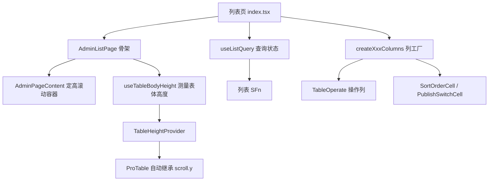

# 管理端列表页规范

> 定位：平台机制类 · 人类阅读
> 单一事实来源：`app/src/utils/use-list-query.ts`（查询状态）、`app/src/components/admin/{AdminListPage,AdminTableToolbar,AdminFormDrawer,PublishedFilter}.tsx`（页面骨架与工具条）、`packages/ui-spa/src/table/{pro-table,table-operate,inline-cells,status-tag,image-cell,table-height}.tsx`（表格与通用态）
> 引用关系：← 被 AGENTS.md「表格操作列」「表格列规范」、[admin-crud](../.agents/skills/admin-crud/SKILL.md)「列表页统一规范」链接；→ 引用上述代码单一事实来源
> 更新触发：列表页骨架 / 查询状态机 / 分页契约 / 表体高度算法 / 通用态组件（排序、状态）变更时

## 概述

管理端带表格的页面约二十个，曾经每一页各自实现筛选、查询状态、分页、排序、错误提示与高度控制。这种重复直接产生了两类问题：

1. **翻页失效**：`pagination.onChange` 与 `Table.onChange` 并存时，antd 翻页会同时触发两者，发出两个请求（其中一个不带 `page`），互相覆盖后表现为「闪一下仍停在第一页」，每页条数调整也永远不生效。
2. **能力漂移**：`showTotal`、每页条数选项、加载态、错误出口、权限置灰、表体高度在不同页面的表现各不相同。

因此把「列表页」抽象为一条固定流水线：骨架负责布局与高度，查询 hook 负责状态与请求，表格负责渲染，单元格负责通用态。页面只声明差异（列、筛选控件、行操作）。

## 分层职责



| 层 | 位置 | 职责 |
|----|------|------|
| 骨架 | `AdminListPage`（app） | 标题栏、看板、工具条、表格区域的间距与高度注入 |
| 查询状态 | `useListQuery`（app） | 条件 / 页码 / 每页条数 / 排序、拉取、服务端回填、过期响应丢弃、列 `sortProps` |
| 表格 | `ProTable`（ui-spa） | 列渲染增强、表体高度继承 |
| 图片列 | `ImageCell`（ui-spa） | 固定正方形 + `contain`，放表最前 |
| 通用态 | `SortOrderCell` / `PublishSwitchCell` / `StatusTag`（ui-spa） | 单元格内联编辑（排序 / 状态）+ 失败回滚 + 状态语义色 |
| 操作列 | `TableOperate`（ui-spa） | 按钮风格、确认、禁用原因提示 |

## 查询状态机

**全部显式触发**，不依赖 effect 自动拉取：

```
路由 loader ──► 首屏数据（useListQuery 的初始值）
                        │
applyFilters(patch) ────┤ 筛选 / 搜索变更 → 回到第 1 页
onTableChange ──────────┤ 翻页 / 排序 / 每页条数 → 排序或页大小变化回第 1 页
reload() ───────────────┘ 增删改 / 内联更新后按当前条件重拉
                        ▼
                    列表 SFn ──► 服务端实际生效的 page / pageSize 回填状态
```

三个设计取舍：

- **不用 effect 拉取**：`useEffect` 与事件回调并存时会重复请求，且触发时机不可预测（曾出现「筛选变化 + 排序 effect」双请求）。首屏交给 loader，后续全部由交互显式触发。
- **不在 `pagination.onChange` 上另接一份逻辑**：分页与排序统一由 `Table.onChange` 驱动；antd 在翻页时会回传当前 sorter，因此这一个入口足以推导出完整的下一步查询。
- **过期响应丢弃**：每次请求自增序号，只有最新序号的响应才会写入状态，连点翻页时旧响应不会覆盖新页面。

## 服务端契约

- 列表 schema 以 `#/validators/common.schemas` 的 `listSchema` 为基座 `.extend({ ...业务筛选 })`，命名为 `<模块>ListSchema`
- **`pageSize` 必须全链路透传**：服务层若硬编码 `pageSize`，前端每页条数控件会成为无效控件
- 排序必须在服务层做白名单映射（`buildSortClause(fieldMap, sortField, sortOrder, 默认字段)`），字段名与列 `dataIndex` 一致；默认排序写在服务层
- 单字段变更（排序权重、上下架、标签）各配一个 SFn + `logCrud` 审计，禁止复用整表更新（否则会把表单里的其它字段一起回写，覆盖他人修改）

## 表体高度算法

管理端内容区是定高滚动容器（`height: calc(100vh - var(--admin-header-height))`，自带 `p-5`，标记 `data-admin-scroll-container`）。

```
表体高度 = 容器可视高度(clientHeight)
         − 表格顶部偏移(以容器为参考系，滚动不影响)
         − 实测表头高
         − 实测分页器高(offsetHeight + 上下 margin)
         − 24px(内容区底部内边距 + 亚像素余量)
（下限 240px；首帧用 480px 兜底，挂载后立即替换为实测值）
```

要点：

- **以容器为参考系**而非视口：容器滚动时两个 `getBoundingClientRect()` 同步位移，测量值恒定；若用 `window.innerHeight - rect.top`，滚动会让测量值反向增大，形成「越滚越高」的正反馈。
- **表头与分页器实测**：窄屏分页器会换行成两排，写死常量会溢出。
- **重算时机**：`window.resize` + `ResizeObserver` 观测内容区及其全部块级子元素（上传列表展开、侧边栏折叠、内容区尺寸变化都会重算）；重算结果不变时 `setState` 自动跳过渲染。

## 图片 / 封面列

列表里的图片列最容易失控：位置各页不同、尺寸一会儿 72×48 一会儿 100×56、`objectFit` 混用导致非方图被裁切或变形，行高也跟着参差。统一为：

- **位置**：表格**最前**（序号、ID、展开、选择等工具列之外的第一列），让「识别对象」先于「读文字」
- **尺寸**：固定正方形（默认 48×48，`ImageCell` 的 `size` 可调），列宽取 `size + 32`（默认 80，容纳单元格内边距）
- **缩放**：`objectFit: contain`，非方图在正方形内留白（配 `bg-background-tertiary` 底色示出画框），**不裁切不变形**
- **空值**：渲染 `—`（`text-foreground-tertiary`），不占位成破图
- **组件**：`@fsdx/ui-spa/table` 的 `ImageCell`（透传 antd `Image`，保留点击预览）；地址由调用方解析（如 `/file/r/${id}`），组件只吃 `src`

## 时间列与空值兜底

- 时间列一律用 ProTable 的 `valueType`（`dateTimeMinute` 到分钟、`dateTime` 到秒），禁止各页手写 `dayjs().format`，列宽按 `YYYY-MM-DD HH:mm` 约 128px 加上下内边距估算（取 `165`），过窄会在空格处折行
- **可为空的值用列的 `emptyText` 兜底**：传 `emptyText: "—"`，渲染结果为空（`null` / `undefined` / 空字符串）时由 ProTable 统一替换，避免各页为零值另写 `render` 与格式化逻辑
- 该能力对任意列生效（不限时间列），典型用法是「过期时间」「最后登录」「发布时间」这类可空列

## 操作列宽度与 `scroll.x`

操作列固定右侧（`fixed: "right"`），antd 对固定列的处理是「按声明的 `width` 占位」——**没写 `width` 的固定列会被压缩到剩余空间**。窄屏下各列宽度之和超过容器宽度时，剩余空间趋近 0，按钮就会溢出到相邻列（出现「下载」压在边框线上这类现象）。

两条硬规则：

- **操作数上限 5**，超出收进「更多」（`TableOperate.Custom`）
- 操作列**必须**显式声明 `width`。估算：每项 `16(图标) + 4(间距) + 文案宽度 + 16(内边距)`，再加单元格左右内边距约 24 → 2 项取 `160`，3 项取 `240`，4 项取 `320`，5 项（含「编辑图片」这类四字文案）取 `400`。操作数超过 5 项时用「更多」折叠，而不是继续加宽。
- `scroll.x` **不小于各列宽度之和**（含操作列）。`scroll.x` 偏小则无宽度列与固定列会被共同挤压，同样溢出；各列宽度调整后需同步回看 `scroll.x`。若存在无宽度列（如文件名、标签，靠分摊剩余空间获得宽度），`scroll.x` 需**大于**定宽列之和，差额即它们的可用宽度。

## 通用态：排序与状态

`sort_order` 与 `is_published` 在数据库层已由 `db/schema/columns.ts` 的 `sortable()` / `publishable()` 统一，UI 层与之对齐。两类通用态各有两种形态。

### 排序

| 场景 | 做法 | 承载物 |
|------|------|--------|
| 表头排序（按列排序） | 列上 `...listQuery.sortProps("createdAt")`（= `sorter: true` + 受控 `sortOrder`），由 `useListQuery.onTableChange` 统一转成查询参数 | `useListQuery().sortProps` |
| 排序权重（改值） | 失焦 / 回车提交，值未变不发请求（点分页也会触发 blur），走单字段 SFn + 审计 | `SortOrderCell` |

同一个「排序」列表头排序与单元格改值可并存——前者改查询参数，后者改行数据；改值后列表按新权重重排、行位置跳变是排序语义的必然结果，因此更新成功后直接 `reload()`。

### 状态

| 形态 | 组件 | 交互 |
|------|------|------|
| 布尔状态（上架 / 启用） | `PublishSwitchCell` | 切换即提交，乐观更新，失败回滚；文案经 `checkedChildren` / `unCheckedChildren` 嵌在轨道内 |
| 多值枚举（只读，静态取值） | `StatusTag` | 值 → 文案 + 语义色（`success` / `warning` / `danger` / `info` / `neutral`），未命中渲染 `—` |
| 多值枚举（只读，字典驱动） | `DictTag` | 按 `dictSlug` 从字典 store 取 label / color，**跟随「字典管理」的编辑结果**（值来自可编辑字典时用它） |
| 多值枚举（可就地切换） | antd `Select`（`variant="borderless"`）或 `Switch` | 与 `PublishSwitchCell` 同构：值未变不提交、乐观更新、失败回滚 |

状态变更一律走**单字段 SFn**（`updateXxxSortSFn` / `setXxxPublishedSFn` / 模块状态 SFn）并写 `logCrud` 审计，不得复用整表更新。状态列不要与操作列重复：就地切换放单元格，操作列只留编辑、删除与少量自定义动作。

## 编辑承载：抽屉

新建 / 编辑统一走 `AdminFormDrawer`，**不再创建 `create.tsx` / `$id/edit.tsx` 路由页**（同步删除旧路由并重新生成 `routeTree.gen.ts`）。

- 表单组件不感知承载容器：`formId` / `hideActions` / `onSubmittingChange` 均为可选 prop，抽屉底部按钮通过 HTML `form` 属性触发提交
- 固定 `destroyOnHidden`：编辑器类组件（富文本）若在 `display:none` 容器中挂载会拿到 0 尺寸，工具栏/内容区渲染异常
- 宽度档位 `FORM_DRAWER_WIDTH`：`base 640` / `wide 760` / `full 40%`
- **单字段快速修改（如文件标签）用 Modal 或单元格内联编辑**，不必开抽屉（参考 `/admin/files` 的标签弹窗）
- 只读列表（日志、埋点、操作日志）没有新建 / 编辑承载，只做骨架 + 查询状态 + 列规范

## 富文本高度

`@easyx/editor` 原生支持 `minHeight` / `maxHeight` / `height` / `resizable`，`@fsdx/ui-spa/editor` 的 `RichEditor` 默认 `minHeight 300` / `maxHeight 512`（内容超限内部滚动），使富文本在抽屉内不会顶出底部按钮。需要更大空间时用组件自带的拖拽手柄（`resizable`，默认开启）或由宿主覆盖。
