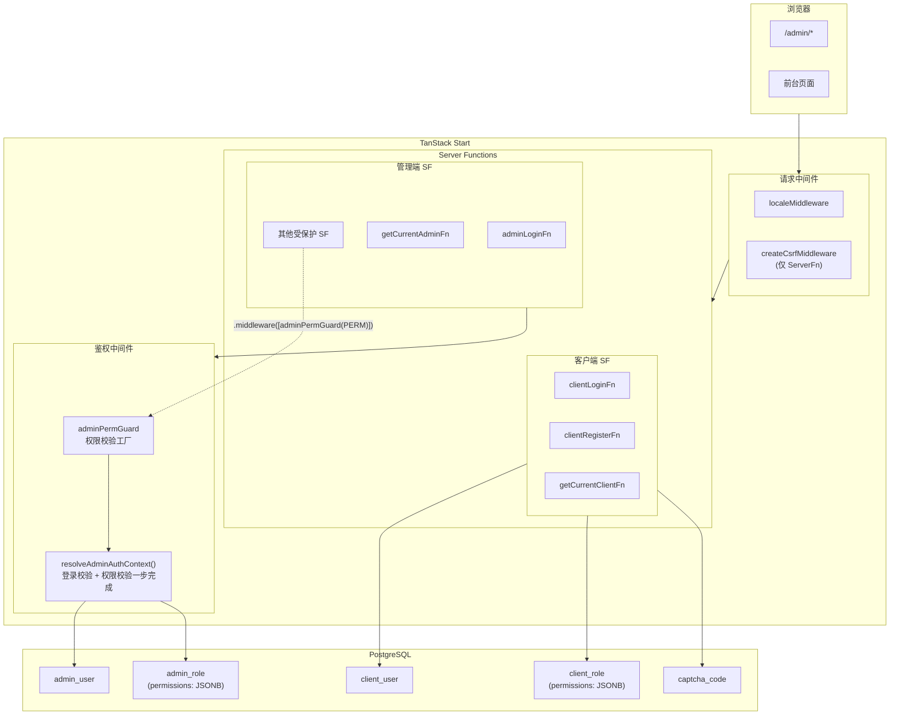
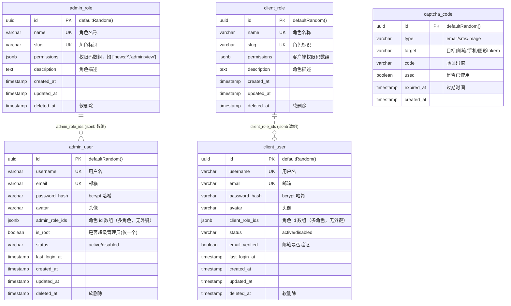
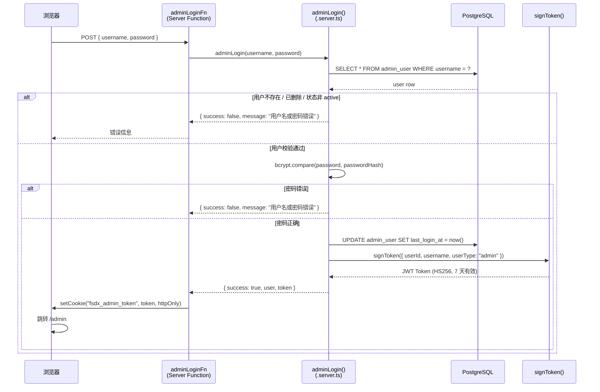
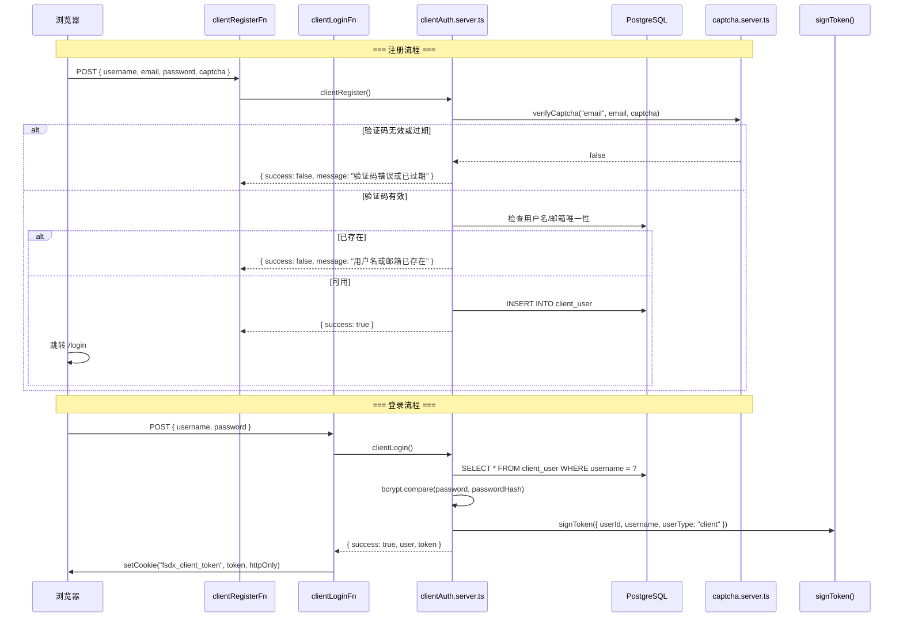
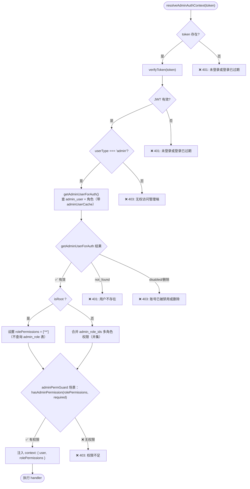
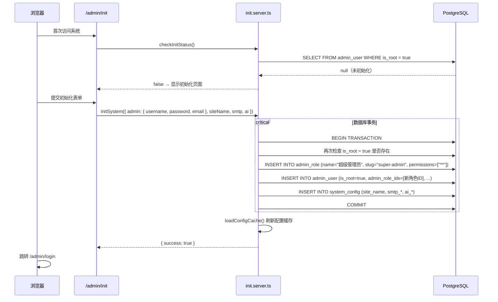

# 身份认证与权限模型

## 概述

本项目采用**双用户体系 + RBAC + JWT** 的认证授权架构：

| 用户体系 | 入口路由 | Cookie 名 | 是否支持 RBAC | 注册方式 |
|----------|----------|-----------|---------------|----------|
| 管理端 (admin) | `/admin/login` | `fsdx_admin_token` | 是（admin_role 表） | 仅管理员手动创建 |
| 客户端 (client) | `/login` | `fsdx_client_token` | 是（client_role 表） | 公开注册 + 邮箱验证码 |

两套体系使用**独立的 Cookie**，允许同一浏览器同时登录管理员和前台用户。

---

## 整体架构



---

## 数据库模型

### ER 图



### 关键约束

- `admin_user.is_root` 有**部分唯一索引**：`CREATE UNIQUE INDEX idx_admin_user_single_root ON admin_user (is_root) WHERE is_root = true`，从数据库层面保证全局仅一个 root 管理员。
- 角色关联使用 `admin_role_ids` / `client_role_ids`（JSONB 字符串数组），支持**多角色**，多角色权限取并集（任一角色含某权限即拥有）；与角色表**无外键约束**。

### `admin_role.permissions` 字段

权限以 `jsonb` 格式存储，值为字符串数组：

```json
["news:*", "admin:view", "admin:create", "dict:*", "dashboard:view"]
```

支持三种通配形式：
- `"**"` — 超级通配符，匹配所有权限
- `"news:*"` — 分组通配符，匹配该模块下所有操作
- `"news:view"` — 精确匹配

### `admin_user` vs `client_user` 差异

| 特性 | admin_user | client_user |
|------|------------|-------------|
| 角色关联 | `admin_role_ids`（JSONB 多角色） | `client_role_ids`（JSONB 多角色） |
| is_root | 有（部分唯一索引） | 无 |
| 邮箱验证 | 无 | `email_verified` 字段 |
| 注册入口 | 管理员手动创建 | 公开 `/register` |
| 认证缓存 | `adminUserCache`（5 分钟 TTL） | `clientUserCache`（5 分钟 TTL） |
| 中间件保护 | `adminAuthGuard` / `adminPermGuard` / `adminPermRouteGuard` | `clientAuthGuard` / `clientPermGuard` / `clientPermRouteGuard` |

---

## 身份认证流程

### 管理员登录时序



### 客户端注册与登录流程



---

## JWT Token

| 字段 | 说明 |
|------|------|
| 算法 | HS256（`jose` 库，`@fsdx/core/jwt`） |
| 密钥 | `process.env.JWT_SECRET`（app 惰性单例壳缓存为 `Uint8Array`） |
| 有效期 | 7 天 |
| 载荷 | `{ userId: string; username: string; userType: "admin" \| "client" }` |

`userType` 字段用于区分管理端和客户端 token，防止跨体系 token 滥用。`verifyToken` 失败时返回 `null`（不抛异常）。

---

## 权限模型 (RBAC)

### 权限码体系

权限码格式：`{模块}:{操作}`，共定义 **61 个权限常量**，按模块分组：

| 模块 | 权限码 |
|------|--------|
| `news` | `view`, `create`, `edit`, `delete`, `publish`, `export`, `import` |
| `admin` | `view`, `create`, `edit`, `delete` |
| `client` | `view`, `create`, `edit`, `delete` |
| `admin-role` | `view`, `create`, `edit`, `delete` |
| `client-role` | `view`, `create`, `edit`, `delete` |
| `dict` | `view`, `create`, `edit`, `delete`, `create-item`, `edit-item`, `delete-item`, `export`, `import` |
| `config` | `view`, `create`, `edit`, `delete`, `export`, `import` |
| `file` | `view`, `upload`, `edit`, `delete` |
| `file-explorer` | `view`, `upload`, `delete`, `rename`, `mkdir` |
| `log` | `view`, `download` |
| `dashboard` | `view` |
| `track` | `view`, `query`, `manage` |
| `message` | `view`, `send`, `delete` |
| `translation` | `view`, `manage`, `export`, `import` |
| `ai` | `test` |

每个权限常量通过 `definePermission(code, name, desc)` 创建，返回 `{ code, name, desc, group }` 结构（`group` 由 code 前缀自动推导）。

### 权限匹配算法

`matchPermission(rolePermissions, requiredCode)` 匹配纯函数在 `@fsdx/core/match-permission`，三级优先级：

1. **`**` 超级通配符**：拥有全部权限，直接通过
2. **精确匹配**：如角色有 `news:create`，请求 `news:create` 通过
3. **分组通配符**：如角色有 `news:*`，请求 `news:create` / `news:edit` 等均通过

关键函数（管理端在 `src/permissions/admin-permissions.ts`，客户端同理）：
- `matchPermission(rolePermissions, requiredCode)` — 核心匹配逻辑
- `hasAdminPermission(rolePermissions, AdminPermissionDef)` — 单个权限校验
- `hasAnyAdminPermission(rolePermissions, AdminPermissionDef[])` — 任意满足（OR）
- `hasAllAdminPermissions(rolePermissions, AdminPermissionDef[])` — 全部满足（AND）

---

## 中间件与守卫

### 中间件执行链路

```
requestMiddleware                    functionMiddleware
┌───────────────────────┐     ┌─────────────────────────┐
│ localeMiddleware      │     │ sfErrorLogger           │
│ createCsrfMiddleware  │     │ (覆盖所有 SF)            │
│ (仅 ServerFn)         │     └─────────────────────────┘
└──────────┬────────────┘
           ▼
  createServerFn.middleware([adminPermGuard(PERM)])
           │
           ▼
  resolveAdminAuthContext(token)        ← 单步完成登录校验 + 权限校验
  ┌──────────────────────────────────┐
  │ verifyToken → userType 校验      │
  │ getAdminUserForAuth (带缓存)      │
  │ isRoot → ["**"] / 合并多角色权限   │
  │ hasAdminPermission 校验           │
  │ runWithRequestContext 注入 operator
  └──────────────────────────────────┘
           │
           ▼
  handler() 执行业务逻辑
```

> 现状：`adminPermGuard(permission)` 内部直接调用 `resolveAdminAuthContext()` 一步完成登录校验 + 权限校验，不再组合 `adminAuthGuard`。`adminAuthGuard`（仅登录）与 `adminPermRouteGuard`（Server Route 专用，捕获 `AdminAuthError` 转 HTTP 状态码）为同一定位于 `src/middleware/admin-auth.ts` 的兄弟中间件。

### `resolveAdminAuthContext` 逻辑



### `adminPermGuard` 工厂函数

```typescript
// src/middleware/admin-auth.ts（现状实现）
export function adminPermGuard(required: AdminPermissionDef) {
  return createMiddleware().server(async ({ next }) => {
    const token = getCookie(COOKIE_NAMES.ADMIN_TOKEN);
    const ctx = await resolveAdminAuthContext(token); // 登录 + 权限校验一步完成
    if (!hasAdminPermission(ctx.rolePermissions, required)) {
      throw new AdminAuthError("权限不足", 403);
    }
    return runWithRequestContext(
      { operator: { id, username, email, type: "admin" } },
      () => next({ context: ctx }),
    );
  });
}
```

**使用示例**：

```typescript
// 仅需登录
export const myFn = createServerFn({ method: "GET" })
  .middleware([adminAuthGuard])
  .handler(async () => { ... });

// 需登录 + 特定权限
export const deleteNewsFn = createServerFn({ method: "POST" })
  .middleware([adminPermGuard(ADMIN_PERMISSIONS.NEWS_DELETE)])
  .handler(async () => { ... });
```

### `AdminAuthError`

自定义错误类，携带 HTTP 状态码：

| 错误信息 | 状态码 | 场景 |
|----------|--------|------|
| `"未登录或登录已过期"` | 401 | Cookie 不存在或 JWT 验证失败 |
| `"无权访问管理端"` | 403 | JWT 的 `userType` 不是 `"admin"` |
| `"用户不存在"` | 401 | JWT 对应的用户记录不存在（如已物理删除） |
| `"账号已被禁用或删除"` | 403 | 用户被软删除或状态非 active |
| `"权限不足"` | 403 | `adminPermGuard` 中权限匹配失败 |

---

## Root 管理员

### 特性

1. **全局唯一** — `admin_user` 表通过部分唯一索引 `idx_admin_user_single_root` 保证仅有一个 `is_root = true` 的记录
2. **自动拥有全部权限** — 在 `resolveAdminAuthContext()` 中，`isRoot` 用户直接设置 `rolePermissions = ["**"]`，**不查询角色表**。这意味着即使 root 关联的角色被删除或权限变更，root 仍保留全部权限
3. **不可禁用** — `src/routes/admin/_admin/users/admins/-mods/admins.server.ts` 中 `updateAdminUser` 禁止设置 root 用户 `status !== "active"`
4. **不可删除** — `src/routes/admin/_admin/users/admins/-mods/admins.server.ts` 中 `deleteAdminUser` 禁止删除 root 用户

### 系统初始化



- 首次访问 `/admin` 时，`/admin/init` 路由 `beforeLoad` 调用 `checkInitStatus()`（查询 `admin_user WHERE is_root = true`）；未初始化 → 停留在初始化页，已初始化 → 重定向 `/admin/login`
- `initSystem()` 在**数据库事务**内完成：二次校验 is_root（防并发）→ INSERT 角色（超级管理员，`["**"]`）→ INSERT root 用户 → INSERT 系统配置（站点名/SMTP/AI）；提交后刷新配置缓存，跳转 `/admin/login`
- 两条路由互为守门人（`/admin/init` 与 `/admin/login`），确保用户始终停留在正确页面

---

## 客户端认证

### 认证 Context

`ClientAuthProvider`（`src/components/client/ClientAuthProvider.tsx`）挂载时自动调用 `getCurrentClientFn()` 获取当前登录用户，通过 React Context 向下传递；前台组件经 `useClientAuth()` 消费 `{ user, isLoading, refetch, logout }`。

### 客户端用户内存缓存

`getCurrentClient()` / `getClientUserForAuth()` 使用 5 分钟 TTL 的内存缓存（`clientUserCache`）减少重复数据库查询。缓存失效场景：
- 管理员修改客户端用户状态或角色时，`src/routes/admin/_admin/users/clients/-mods/clients.server.ts` 主动调用 `clientUserCache.delete(userId)`
- 管理员删除客户端用户时，同样清除缓存

### 管理员端认证状态

管理员端在 `/admin/_admin` 布局路由的 `beforeLoad` 中调用 `getCurrentAdminSFn`，返回值通过路由 context 传递给所有子页面。该布局设置 `ssr: false`，所有鉴权在客户端完成。

---

## CSRF 保护

在 `src/start.ts` 中注册 `createCsrfMiddleware`：

```typescript
const csrfMiddleware = createCsrfMiddleware({
  filter: (ctx) => ctx.handlerType === "serverFn",
});
```

- **仅对 Server Function 请求生效**，页面渲染请求不受影响
- 默认校验 `Origin`、`Referer`、`Sec-Fetch-Site` 头，拒绝跨站请求
- 位于 `requestMiddleware` 数组中，在 `localeMiddleware` 之后执行

---

## 安全要点汇总

| 层面 | 措施 |
|------|------|
| 密码存储 | bcrypt 哈希（admin 创建用 cost=12，client 注册用 cost=10） |
| Token | HS256 JWT，7 天有效期，httpOnly Cookie |
| Cookie | 管理端/客户端独立 Cookie，避免相互覆盖 |
| CSRF | TanStack Start 内置 CSRF 中间件，仅 ServerFn 生效 |
| 权限 | RBAC + 三级权限匹配，root 自动绕过角色表 |
| 软删除 | 所有用户/角色表使用 `deleted_at`，查询始终过滤 |
| 防并发初始化 | 数据库事务内二次校验 is_root |
| 构建安全 | Vite 配置禁止 `bcryptjs` / `drizzle-orm` 进入客户端 bundle |
| Root 保护 | 数据库唯一索引 + 禁用/删除拦截 |

---

## 关键文件索引

| 文件 | 职责 |
|------|------|
| `packages/core/src/infra/jwt/index.ts` | JWT 签发/校验（`createJwt`，`@fsdx/core/jwt`） |
| `src/lib/jwt/jwt.ts` | JWT 应用级单例壳（惰性） |
| `src/constants/cookie-names.ts` | Cookie 名称常量（`fsdx_admin_token` / `fsdx_client_token`） |
| `src/permissions/admin-permissions.ts` | 管理端权限码常量（`ADMIN_PERMISSIONS` / `ADMIN_PERMISSIONS_BY_GROUP` / `hasAdminPermission` 等） |
| `packages/core/src/utils/match-permission/index.ts` | 权限匹配纯函数（`matchPermission`，`@fsdx/core/match-permission`） |
| `src/middleware/admin-auth.ts` | `adminAuthGuard` / `adminPermGuard` / `adminPermRouteGuard` 中间件 |
| `src/middleware/admin-auth.server.ts` | `resolveAdminAuthContext()` 登录校验 + 权限解析 |
| `src/middleware/client-auth.ts` | `clientAuthGuard` / `clientPermGuard` / `clientPermRouteGuard` 中间件 |
| `src/services/admin-auth/admin-auth.server.ts` | 管理员登录、当前管理员查询 |
| `src/services/client-auth/client-auth.server.ts` | 客户端登录、注册、当前用户查询（含缓存） |
| `src/services/client-auth/client-auth.functions.ts` | 客户端认证 Server Function 包装器 |
| `src/services/init/init.server.ts` | 系统初始化（checkInitStatus / initSystem） |
| `src/routes/admin/_admin/users/admins/-mods/admins.server.ts` | 管理员 CRUD（含 root 禁用/删除拦截） |
| `src/routes/admin/_admin/users/clients/-mods/clients.server.ts` | 客户端用户 CRUD |
| `src/services/admin-role/admin-role.server.ts` | 管理端角色 CRUD |
| `src/services/client-role/client-role.server.ts` | 客户端角色 CRUD |
| `src/db/schema/admin-user.ts` | admin_user 表（含部分唯一索引） |
| `src/db/schema/client-user.ts` | client_user 表 |
| `src/db/schema/admin-role.ts` | admin_role 表（permissions JSONB） |
| `src/db/schema/client-role.ts` | client_role 表 |
| `src/routes/admin/_admin.tsx` | 管理端布局：beforeLoad 鉴权 |
| `src/routes/admin/login.tsx` | 管理端登录页 |
| `src/routes/admin/init.tsx` | 系统初始化页 |
| `src/components/client/ClientAuthProvider.tsx` | 客户端认证 Context |
| `src/start.ts` | CSRF 中间件注册 |
