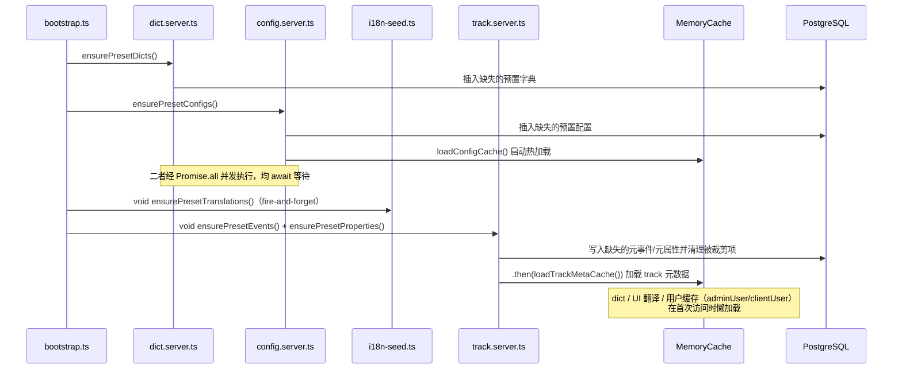

# 缓存体系

## 概述

系统使用基于 `Map` 的**内存缓存**实现，通过 `MemoryCache<T>` 通用类提供统一接口。所有缓存在服务进程内存中，重启即清空：启动时 `ensurePreset*` 初始化预置数据（dict/config/track 元数据，其中 config 与 track 元数据缓存启动即热加载），dict、UI 翻译与用户缓存（adminUser/clientUser）在首次访问时懒加载回填。

## MemoryCache 通用类

泛型类在 `@fsdx/core/cache-core`（`MemoryCache<T>`），实例按模块拆分在 `services/<module>/<module>.cache.ts`：

```
@fsdx/core/cache-core (MemoryCache)

class MemoryCache<T> {
    constructor(options?: { defaultTTL?: number; name?: string })

    get(key: string): T | undefined      // 获取值（自动处理过期）
    set(key: string, value: T, ttl?: number): void  // 写入值
    delete(key: string): void             // 删除单个键
    has(key: string): boolean             // 检查键是否存在（含过期判断）
    clear(): void                         // 清空全部
    keys(): string[]                      // 获取所有有效键
    size: number                          // 有效条目数
    cleanup(): number                     // 手动清理过期项
}
```

**核心特性：**
- 基于 `Map<string, CacheEntry<T>>`，O(1) 读写
- `get()` 时自动检查 TTL 过期，过期项自动删除并返回 `undefined`
- `set()` 支持传入 `ttl` 覆盖默认值，`ttl=0` 表示永不过期
- `cleanup()` 遍历全量清理过期项，返回清理数量
- 构造时 `name` 参数用于调试和日志区分

---

## 8 个缓存实例（`MemoryCache` 类 + 按模块实例文件）

> 每个实例只能在唯一一个服务端模块中直接操作（get/set/delete），禁止跨模块 import 缓存实例；外部模块通过所属模块的导出函数访问。

### 字典缓存 (`dictCache`)

| 属性 | 值 |
|------|-----|
| Key | `dictSlug`（如 `"news_status"`） |
| Value | `Record<string, { label: string; color?: string \| null }>` |
| TTL | 无（永不过期） |
| 加载 | `loadDictCache()` → `dictCache.set(dictSlug, {...})` |
| 查询 | `getDictLabel(slug, value)`、`getDictMap(slug)`、`getDictOptions(slug)` |

字典缓存在启动时全量加载，管理端修改字典后通过 Server Function 主动刷新。

### 系统配置缓存 (`configCache`)

| 属性 | 值 |
|------|-----|
| Key | 固定 `"all"` |
| Value | `CachedConfig[]`（数组） |
| TTL | 无（永不过期） |
| 加载 | `loadConfigCache()` → `configCache.set("all", rows)` |
| 查询 | `getConfig(key)` 返回 `string` |

SMTP 邮件配置从数据库读取而非环境变量，通过此缓存获取。管理端修改配置后触发缓存刷新。

### UI 翻译缓存 (`uiTranslationCache`)

| 属性 | 值 |
|------|-----|
| Key | `locale`（如 `"en"`、`"zh"`） |
| Value | `Record<string, string>`（`{ 中文Key: 翻译值 }`） |
| TTL | 无（永不过期） |
| 加载 | `loadUITranslations()` |
| 查询 | `getUITranslations(locale)` |

启动时加载所有语言的 UI 翻译，管理端修改翻译后触发局部刷新。

### 配置翻译缓存 (`configTranslationCache`)

| 属性 | 值 |
|------|-----|
| Key | `locale` |
| Value | `Record<string, string>`（`{ configId: translatedValue }`） |
| TTL | 无（永不过期） |
| 加载 | `loadConfigTranslationCache()` |
| 刷新 | `refreshConfigTranslationCache(locale?)` |

为系统配置项（如站点名称）提供多语言翻译支持。

### 客户端用户缓存 (`clientUserCache`)

| 属性 | 值 |
|------|-----|
| Key | `userId` |
| Value | `{ id, username, email, avatar, clientRoleIds, status }` |
| TTL | **5 分钟** |

用于减少 `getCurrentClient()` / `getClientUserForAuth()` 的数据库查询频率。缓存失效场景：
- 管理员修改客户端用户状态或角色分配 → 主动 `clientUserCache.delete(userId)`
- 管理员删除客户端用户 → 主动清除
- TTL 自然过期

### 管理员用户缓存 (`adminUserCache`)

| 属性 | 值 |
|------|-----|
| Key | `userId` |
| Value | `{ id, username, email, avatar, isRoot, adminRoleIds, status }` |
| TTL | **5 分钟** |

用于减少 `getAdminUserForAuth()`（鉴权中间件核心调用）的数据库查询频率。isRoot 用户命中缓存后直接返回 `["**"]` 权限，不查角色表。缓存失效场景：管理员状态/角色变更、删除。

### 元事件缓存 (`trackEventMetaCache`)

| 属性 | 值 |
|------|-----|
| Key | 事件名称（如 `"PageView"`） |
| Value | `boolean`（`true` 表示已注册） |
| TTL | 无（永不过期，随元数据变更主动失效） |

用于 `trackEvent()` 中快速校验上报事件名是否已注册，避免每次查询数据库。

### 元属性缓存 (`trackPropertyMetaCache`)

| 属性 | 值 |
|------|-----|
| Key | 属性键（如 `"page_name"`、`"$ip"`） |
| Value | `string`（数据类型，如 `"string"`、`"number"`） |
| TTL | 无（永不过期，随元数据变更主动失效） |

用于 `trackEvent()` 中校验上报属性的键是否存在及其值的类型是否匹配。

---

## 缓存生命周期

### 启动阶段



### 运行阶段

```
管理端修改数据
    ↓
Server Function handler
    ↓
更新数据库 + 主动刷新对应缓存实例
    ↓
下次读取命中新缓存
```

### 关闭阶段

无需特殊处理，进程退出后内存自动释放。

---

## 缓存失效策略

| 缓存 | 失效方式 | 触发场景 |
|------|----------|----------|
| `dictCache` | `loadDictCache()` 全量重载 | 字典/条目 CRUD |
| `configCache` | `loadConfigCache()` 全量重载 | 系统配置 CRUD |
| `uiTranslationCache` | `refreshUITranslationCache(locale?)` | UI 翻译增删改 |
| `configTranslationCache` | `refreshConfigTranslationCache(locale?)` | 配置翻译修改 |
| `clientUserCache` | `clientUserCache.delete(userId)` | 用户状态变更/删除 |
| `adminUserCache` | `adminUserCache.delete(userId)` | 管理员状态/角色变更/删除 |
| `trackEventMetaCache` | `invalidateTrackMetaCache()` + 下次懒加载 | 元事件增删改 |
| `trackPropertyMetaCache` | `invalidateTrackMetaCache()` + 下次懒加载 | 元属性增删改 |

---

## 单实例与数据一致性边界

- 所有 8 个缓存实例均为进程内 `MemoryCache`，缓存失效（`loadXxxCache` / `delete`）仅作用于当前实例，多实例部署时实例间缓存会短暂不一致。
- `MemoryCache` 已实现 `CacheAdapter` 接口，未来升级多实例可用 Redis 等分布式缓存适配器替换内存实现而不改动业务层。
- 无持久化：进程退出后缓存数据自动丢失，重启后按需懒加载重建。

---

## 关键文件索引

| 文件 | 职责 |
|------|------|
| `packages/core/src/cache/cache-core/index.ts` | `MemoryCache<T>` 通用类（`@fsdx/core/cache-core`） |
| `services/<module>/<module>.cache.ts` | 按模块拆分的缓存实例（config/dict/i18n/client-auth/admin-auth/track） |
| `packages/core/src/cache/cache-core/__tests__/cache-core.test.ts` | 缓存单元测试 |
| `src/services/config/config.server.ts` | `loadConfigCache()` / 配置缓存管理 |
| `src/services/dict/dict.server.ts` | `loadDictCache()` / 字典缓存管理 |
| `src/services/i18n/i18n.server.ts` | UI 翻译缓存管理 |
| `src/services/client-auth/client-auth.server.ts` | 客户端用户缓存使用 |
| `src/services/track/track.server.ts` | 元事件/元属性缓存管理 |
