# 数据库设计

## 表总览

共 15 张表，按用途分为三组：

### 业务表（6 张）

| 表名 | 主键 | 软删除 | 核心职责 |
|------|------|--------|----------|
| `admin_user` | UUID | `deleted_at` | 管理端用户（含 root），关联 `role_id` FK |
| `client_user` | UUID | `deleted_at` | 前台注册用户，无 RBAC |
| `role` | UUID | `deleted_at` | RBAC 角色，`permissions` 为 JSONB 字符串数组 |
| `news` | UUID | `deleted_at` | 新闻文章，`content` 为 TipTap JSON |
| `dict` | UUID | `deleted_at` | 字典类型（`name` + `slug`） |
| `dict_item` | UUID | `deleted_at` | 字典条目，`dict_slug` FK → dict.slug，唯一约束 `(dict_slug, value)` |

### 系统表（5 张）

| 表名 | 主键 | 软删除 | 核心职责 |
|------|------|--------|----------|
| `file` | UUID | `deleted_at` | 文件元数据，`sha256` 索引支持秒传 |
| `system_config` | UUID | `deleted_at` | 键值配置（`key` 唯一），含 SMTP/AI/站点设置 |
| `ui_translation` | UUID | — | UI 固定文案翻译，唯一约束 `(locale, key)` |
| `content_translation` | UUID | — | 实体字段翻译，唯一约束 `(entity_type, entity_id, field_name, locale)` |
| `captcha_code` | UUID | — | 验证码记录（邮箱/SMS/图形） |

### 埋点与审计表（4 张）

| 表名 | 主键 | 软删除 | 核心职责 |
|------|------|--------|----------|
| `event` | UUID | — | 埋点原始事件，`properties` 为 JSONB |
| `preset_event` | name (varchar) | — | 预设事件定义，`is_preset` 标记是否系统预置 |
| `preset_property` | key (varchar) | — | 预设属性定义，`data_type` 声明值类型 |
| `operation_log` | UUID | — | 管理端操作审计日志，`detail` 为 JSONB |

---

## ER 图

```mermaid
erDiagram
    admin_user {
        uuid id PK
        varchar username UK
        varchar email UK
        varchar password_hash
        varchar avatar
        uuid role_id FK
        boolean is_root "部分唯一索引"
        varchar status "active/disabled"
        timestamp last_login_at
        timestamp created_at
        timestamp updated_at
        timestamp deleted_at
    }

    role {
        uuid id PK
        varchar name
        varchar slug UK
        jsonb permissions "字符串数组，如 ['news:*','admin:view']"
        text description
        timestamp created_at
        timestamp updated_at
        timestamp deleted_at
    }

    client_user {
        uuid id PK
        varchar username UK
        varchar email UK
        varchar password_hash
        varchar avatar
        varchar status "active/disabled"
        boolean email_verified
        timestamp last_login_at
        timestamp created_at
        timestamp updated_at
        timestamp deleted_at
    }

    news {
        uuid id PK
        varchar title
        varchar slug UK
        jsonb content "TipTap JSON"
        varchar cover_image_id FK
        varchar status "draft/published/archived"
        boolean is_pinned
        int sort_order
        timestamp published_at
        uuid created_by_id FK
        uuid updated_by_id FK
        timestamp created_at
        timestamp updated_at
        timestamp deleted_at
    }

    dict {
        uuid id PK
        varchar name
        varchar slug UK
        text description
        boolean is_preset
        int sort_order
        timestamp created_at
        timestamp updated_at
        timestamp deleted_at
    }

    dict_item {
        uuid id PK
        varchar dict_slug FK "CASCADE"
        varchar label
        varchar value
        int sort_order
        varchar status "active/disabled"
        varchar extra_type
        jsonb extra
        varchar color
        timestamp created_at
        timestamp updated_at
        timestamp deleted_at
    }

    file {
        uuid id PK
        varchar sha256 "索引"
        varchar original_name
        varchar stored_name
        varchar mime_type
        bigint size
        varchar path
        varchar status "temp/permanent"
        timestamp expired_at "临时文件过期时间"
        timestamp created_at
        timestamp updated_at
        timestamp deleted_at
    }

    system_config {
        uuid id PK
        varchar key UK
        text value
        boolean client_visible
        varchar value_type
        varchar group_name "索引"
        text description
        timestamp created_at
        timestamp updated_at
        timestamp deleted_at
    }

    ui_translation {
        uuid id PK
        varchar locale
        varchar key
        text value
        varchar value_type
        timestamp created_at
        timestamp updated_at
    }

    content_translation {
        uuid id PK
        varchar entity_type "索引"
        varchar entity_id "索引"
        varchar field_name
        varchar locale "索引"
        text value
        varchar value_type
        timestamp created_at
        timestamp updated_at
    }

    event {
        uuid id PK
        timestamp time "索引"
        uuid user_id "索引"
        varchar session_id "索引"
        varchar event "索引"
        jsonb properties
        timestamp created_at "索引"
    }

    preset_event {
        varchar name PK
        varchar label
        varchar category
        text description
        boolean is_preset
        timestamp created_at
        timestamp updated_at
    }

    preset_property {
        varchar key PK
        varchar label
        varchar data_type
        text description
        boolean is_preset
        timestamp created_at
        timestamp updated_at
    }

    operation_log {
        uuid id PK
        uuid operator_id FK "索引"
        varchar operator_name
        varchar module "索引"
        varchar action
        varchar target_type
        varchar target_id
        varchar target_name
        jsonb detail
        timestamp created_at "索引"
    }

    captcha_code {
        uuid id PK
        varchar type "email/sms/image"
        varchar target
        varchar code
        boolean used
        timestamp expired_at
        timestamp created_at
    }

    role ||--o{ admin_user : "role_id FK"
    dict ||--o{ dict_item : "dict_slug FK (CASCADE)"
    file ||--o{ news : "cover_image_id FK"
    admin_user ||--o{ news : "created_by_id / updated_by_id FK"
    admin_user ||--o{ operation_log : "operator_id FK"
```

---

## 列命名约定

所有表统一遵循以下规则：

| 用途 | 数据库列名 | JS 属性名 | Drizzle 类型 | 备注 |
|------|-----------|----------|-------------|------|
| 主键 | `id` | `id` | `uuid().defaultRandom()` | 一律 UUID |
| 创建时间 | `created_at` | `createdAt` | `timestamp({ withTimezone: true }).defaultNow()` | 自动设置 |
| 更新时间 | `updated_at` | `updatedAt` | `timestamp({ withTimezone: true }).defaultNow().onUpdateNow()` | 自动更新 |
| 软删除 | `deleted_at` | `deletedAt` | `timestamp({ withTimezone: true })` | 非 NULL 表示已删除 |
| 描述 | `description` | `description` | `text()` | — |
| 排序 | `sort_order` | `sortOrder` | `integer().default(0)` | — |
| 外键 | `xxx_id` | `xxxId` | `uuid().references(() => table.id)` | — |

要点：
- 所有列**必须**显式指定数据库列名（如 `createdAt: timestamp("created_at", { withTimezone: true })`）
- timestamp 列**必须**加 `{ withTimezone: true }`
- 新增/修改 Schema 后运行 `pnpm db:push`，重命名列时选择 `rename column`

---

## 关键约束

### 唯一约束

| 表 | 约束 | 索引类型 |
|----|------|----------|
| `admin_user` | `is_root = true` 仅一条 | 部分唯一索引 `WHERE is_root = true` |
| `admin_user` | `username`, `email` | 普通唯一 |
| `client_user` | `username`, `email` | 普通唯一 |
| `role` | `slug` | 普通唯一 |
| `news` | `slug` | 普通唯一 |
| `dict` | `slug` | 普通唯一 |
| `dict_item` | `(dict_slug, value)` | 复合唯一 |
| `system_config` | `key` | 普通唯一 |
| `ui_translation` | `(locale, key)` | 复合唯一 |
| `content_translation` | `(entity_type, entity_id, field_name, locale)` | 复合唯一 |

### 软删除策略

以下表使用 `deleted_at` 软删除：
`admin_user`、`client_user`、`role`、`news`、`dict`、`dict_item`、`file`、`system_config`

查询时通过 `notDeleted(col)` 工具函数过滤（`isNull(deleted_at)`）。

以下表不设软删除（写入后不可删除或仅逻辑删除）：
`event`、`preset_event`、`preset_property`、`operation_log`、`captcha_code`、`ui_translation`、`content_translation`

### 外键关系

| 子表 | 列 | 父表 | CASCADE |
|------|----|------|---------|
| `admin_user` | `role_id` | `role.id` | 否 |
| `news` | `cover_image_id` | `file.id` | 否 |
| `news` | `created_by_id` | `admin_user.id` | 否 |
| `news` | `updated_by_id` | `admin_user.id` | 否 |
| `dict_item` | `dict_slug` | `dict.slug` | **是** |
| `operation_log` | `operator_id` | `admin_user.id` | 否 |

---

## 预置数据

系统启动时通过 `ensurePreset*` 函数自动初始化以下预置数据：

| 预置类型 | 入口函数 | 数据内容 |
|----------|----------|----------|
| 字典 | `ensurePresetDicts()` | 预置字典类型和条目 |
| 系统配置 | `ensurePresetConfigs()` | 17 个预置配置项（SMTP、AI、站点设置等） |
| 预设事件 | `ensurePresetEvents()` | 8 个事件类型（PageView、Click、FormSubmit 等） |
| 预设属性 | `ensurePresetProperties()` | 11 个属性定义（包含 5 个 `$` 系统属性） |
| UI 翻译 | `ensurePresetTranslations()` | 英文翻译种子数据 |

预置数据标记 `is_preset = true`，在管理端不可删除。

---

## 关键文件索引

| 文件 | 职责 |
|------|------|
| `src/db/schema/index.ts` | 全部 14 张表统一导出 |
| `src/db/index.ts` | Drizzle 客户端懒加载实例 |
| `src/db/schema/*.ts` | 各表 Drizzle Schema 定义 |
| `env/.env.example` | 环境变量模板（`DATABASE_URL`） |
| `drizzle.config.ts` | Drizzle Kit 配置（dialect、schema 路径） |
