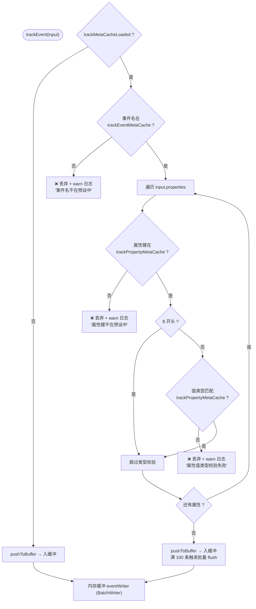

# 事件埋点系统

## 架构概览

系统提供从**客户端采集 → 服务端校验 → 缓冲写入 → 查询分析**的完整埋点链路。

```
┌──────────────────────────────────────────────────────────────┐
│                        客户端 (Browser)                       │
│                                                              │
│  init() / setUserId() / track() / startRouteTracking()      │
│       │                                                      │
│       ▼                                                      │
│  trackEventSFn()  ──── Server Function ────►                │
│                                                              │
├──────────────────────────────────────────────────────────────┤
│                        服务端                                 │
│                                                              │
│  trackEvent(input)                                           │
│       │                                                      │
│       ├─ 校验事件名 (trackEventMetaCache)                        │
│       ├─ 校验属性键 (trackPropertyMetaCache)                      │
│       └─ 校验属性值类型 (isValidPropertyValue)                 │
│              │                                               │
│              ▼                                               │
│  ┌─────────────────────┐                                     │
│  │   内存缓冲队列        │  上限 1000 条                        │
│  │   eventWriter (BatchWriter)      │                                     │
│  └────────┬────────────┘                                     │
│           │  5 秒 / 100 条 / SIGTERM                         │
│           ▼                                                  │
│  track_event 表 (PostgreSQL)                                       │
│       │                                                      │
│       ├── searchTrackEvents()      分页查询                        │
│       ├── getTrackAnalytics() 趋势/分布/Top页面                │
│       └── getTrackEventNames()     事件名列表                       │
└──────────────────────────────────────────────────────────────┘
```

---

## 客户端 SDK

位于 `src/lib/track/track.ts`，核心 API：

### 初始化

```typescript
import { init, setUserId, track } from '#/lib/track/track'

// 初始化（自动采集 PageView 并生成 sessionId）
init({ autoPageView: true })

// 登录后设置用户 ID
setUserId(userId)

// 手动上报事件
track('Click', { element_id: 'btn-submit', element_text: '提交' })
```

### 自动采集

| 采集项 | 来源 | 说明 |
|--------|------|------|
| `sessionId` | `sessionStorage` | Base36 时间戳 + 随机数，跨 Tab 独立 |
| `url` | `window.location.href` | 当前完整 URL |
| `referer` | `document.referrer` | 来源页面 |
| `page_name` | `document.title` | 页面标题 |
| `$screen_size` | `window.screen` | 屏幕分辨率 `WxH` |
| PageView 事件 | 初始化 + pushState/popstate | SPA 路由导航自动采集 |

### 路由追踪

通过 `startRouteTracking()` 劫持 `history.pushState` 和 `popstate` 事件，在 SPA 导航时自动上报 `PageView`。注意 `replaceState` 不触发（非导航行为）。

---

## 服务端 `trackEvent()` 校验链



### 属性值类型校验

支持 6 种数据类型，每种有独立的校验逻辑和安全限制：

| 类型 | 允许值 | 限制 |
|------|--------|------|
| `string` | string | 最大 10000 字符 |
| `number` | number (finite) | ±1e15 范围 |
| `boolean` | boolean | — |
| `date` | ISO 字符串 或 毫秒时间戳 | 不超过未来一年 |
| `array` | 基本类型元素数组 | 最多 100 项，禁止嵌套对象 |
| `object` | 纯对象（非数组/null） | 深度 ≤5，键数 ≤50，禁止 `__proto__`/`constructor`/`prototype` |

---

## 缓冲写入策略

```
写入入口: pushToBuffer(input)
    ├─ 缓冲未满 → 追加到 eventWriter (BatchWriter)
    ├─ 缓冲命中 BATCH_SIZE(100) → 立即 flushEventBuffer("batch")
    ├─ 缓冲命中 MAX_BUFFER_SIZE(1000) → 丢弃最旧条目 + warn 日志
    └─ 定时器 FLUSH_INTERVAL(5000ms) → 定时 flushEventBuffer("timer")

刷新过程: flushEventBuffer(source)
    ├─ 复制当前批次 [...eventBuffer]
    ├─ db.insert(event).values(batch) 批量 INSERT
    ├─ 成功后 eventBuffer.splice(0, batch.length) 移除已写入项
    └─ 失败后保留缓冲，记录 error 日志

强制刷新: flushTrackEvents() (进程退出时调用)
    ├─ 清除定时器
    └─ flushEventBuffer("shutdown")
```

---

## 单实例与数据一致性边界

- **缓冲丢失窗口**：埋点事件经 `BatchWriter` 内存缓冲，进程崩溃或异常退出会丢失未刷入数据库的至多 5 秒 / 100 条（缓冲满 1000 条时丢弃最旧条目）。
- **频控进程内**：`sessionRateCache`（`track_rate_limit`，会话频控 60 条/分，全系统第 9 个 `MemoryCache` 实例）仅单实例部署有效；多实例时退化为每实例 60 条/分。
- **元数据缓存进程内**：`trackEventMetaCache` / `trackPropertyMetaCache` 为进程内缓存，管理端编辑元数据仅失效当前实例。
- **演进接缝**：`BatchWriter.insertFn` 为队列/持久化接缝，升级多实例时可将其替换为消息队列投递，业务调用方无需改动。
- 完整的单实例边界与扩容路径 → [部署运维](deployment-ops.md)。

---

## 预置元事件与元属性

### 5 个预置元事件

| 事件名 | 标签 | 分类 |
|--------|------|------|
| `PageView` | 页面浏览 | 页面交互 |
| `FormSubmit` | 表单提交 | 用户行为 |
| `Login` | 用户登录 | 用户行为 |
| `Register` | 用户注册 | 用户行为 |
| `Logout` | 用户退出 | 用户行为 |

> 自定义事件需先在管理端 `/admin/track/event-meta/` 注册，否则上报被丢弃（详见「预设管理」）。

### 11 个预置元属性

| 属性键 | 标签 | 类型 | 说明 |
|--------|------|------|------|
| `$ip` | IP 地址 | string | 服务端提取 |
| `$user_agent` | User Agent | string | — |
| `$browser` | 浏览器 | string | — |
| `$os` | 操作系统 | string | — |
| `$device_type` | 设备类型 | string | Desktop/Mobile/Tablet |
| `$screen_size` | 屏幕分辨率 | string | 客户端自动采集 |
| `$language` | 浏览器语言 | string | 客户端自动采集（navigator.language） |
| `page_name` | 页面名称 | string | 客户端自动采集 |
| `url` | 页面地址 | string | 客户端自动采集 |
| `referer` | 来源地址 | string | 客户端自动采集 |
| `form_name` | 表单名称 | string | 被提交的表单名称（如 clientLogin、clientRegister） |

`$` 前缀属性（前 7 个）为系统属性，校验时仅检查键是否存在，不做值类型校验（由服务端补齐）。

---

## 查询与分析

### 事件查询

`searchTrackEvents(query)` — 支持按事件名、用户 ID、会话 ID、关键词、日期范围筛选，分页返回 `EventQueryResult`。

### 事件分析

`getTrackAnalytics(query)` — 返回 `AnalyticsResult`：

| 字段 | 说明 |
|------|------|
| `timeSeries` | 按小时/天聚合的时间序列趋势 |
| `eventDistribution` | 各事件类型数量分布 |
| `topPages` | PageView 事件中 Top 20 页面 |
| `uniqueUsers` | 独立用户数（userId 优先，fallback sessionId） |
| `totalEvents` | 总事件数 |

---

## 预设管理

管理端 `/admin/track/event-meta/` 和 `/admin/track/property-meta/` 页面支持：
- 查看预设事件/属性列表
- 新增自定义事件/属性
- 编辑事件/属性（`is_preset = true` 的不可删除）
- 操作后自动使缓存失效，下次访问重新加载

---

## 关键文件索引

| 文件 | 职责 |
|------|------|
| `src/lib/track/track.ts` | 客户端埋点 SDK |
| `src/services/track/track.server.ts` | 服务层入口（barrel）：事件上报缓冲写入 + 统一导出 |
| `src/services/track/track.validate.ts` | 属性值类型校验、per-session 频控、服务端时间钳制（纯逻辑） |
| `src/services/track/track.meta.ts` | 元事件/元属性管理（预设、CRUD、`loadTrackMetaCache()`） |
| `src/services/track/track.analytics.ts` | 查询与分析（`searchTrackEvents` / `getTrackAnalytics` / `getTrackEventNames`） |
| `src/services/track/track.functions.ts` | Server Function 包装器 |
| `src/services/track/track.types.ts` | 类型定义 |
| `src/services/track/track.cache.ts` | trackEventMetaCache / trackPropertyMetaCache 缓存实例 |
| `src/db/schema/track.ts` | track_event / track_event_meta / track_property_meta 表 Schema |
| `src/routes/admin/_admin/track/query.tsx` | 事件查询页面 |
| `src/routes/admin/_admin/track/analytics.tsx` | 事件分析页面 |
