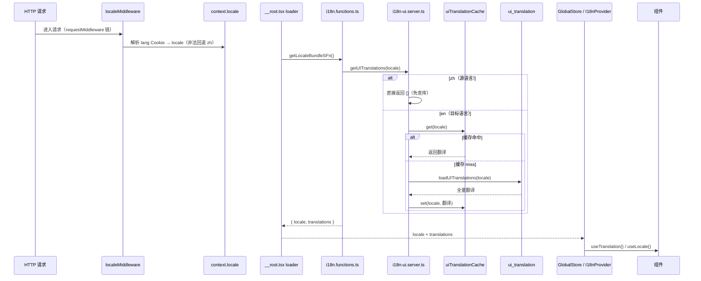
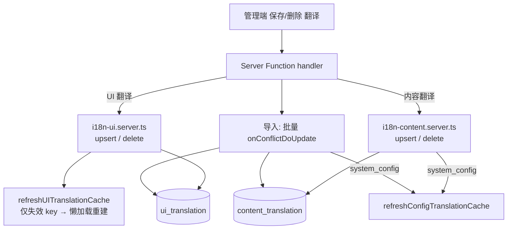

# 国际化（i18n）

> 定位：平台机制类 · 人类阅读
> 单一事实来源：`src/shared-services/i18n/*`（类型/服务/种子）、`src/db/schema/translation.ts`（两张翻译表）、`src/components/providers/*`（Provider 与 hooks）
> 引用关系：← 被 architecture-overview、README「文档」索引、i18n skill 链接；→ 引用 i18n 代码单一事实来源
> 更新触发：i18n 分层 / 语言检测链路 / 缓存策略 / 新增语言或新增内容翻译机制变更时

## 概述

本项目采用**中文原文作为翻译 key** 的国际化方案，基于 i18next + react-i18next，前台 SSR 页面与管理端翻译管理共用一套基础设施。翻译按用途分为两层：

- **UI 翻译**（`ui_translation` 表）：前台页面固定文案，key 为中文原文（如 `t("首页")`），目标语言映射到英文值；进程内按 locale 惰性全量缓存。
- **内容翻译**（`content_translation` 表）：实体字段（如新闻标题/摘要/正文）的按需翻译，默认语言（zh）存主表原字段，其它语言翻译按 `(entityType, entityId, fieldName, locale)` 定位；无缓存、按需查询。

> 事实以代码为准：支持语言、Seed 清单、缓存实例、表清单分别见 `i18n-types.ts`、`i18n-seed.ts`、`ui-translation.cache.ts`、`src/db/schema/translation.ts`。

## 架构总览

```mermaid
flowchart TD
    subgraph 请求层
        MW[localeMiddleware<br/>解析 lang Cookie → context.locale]
    end

    subgraph 服务层 shared-services/i18n
        FN[i18n.functions.ts<br/>getLocaleBundleSFn / getFieldTranslationsSFn<br/>saveContentTranslationSFn / aiTranslateFieldSFn]
        UI[i18n-ui.server.ts<br/>UI 翻译 查询/维护/导入导出]
        CT[i18n-content.server.ts<br/>实体翻译 查询/维护]
        IO[i18n-content-io.ts<br/>实体翻译 导入导出]
        SEED[i18n-seed.ts<br/>ensurePresetTranslations]
        BARREL[i18n.server.ts<br/>barrel 统一导出]
    end

    subgraph 数据与缓存
        UICACHE[uiTranslationCache<br/>MemoryCache 按 locale 惰性全量]
        DBUI[(ui_translation)]
        DBCT[(content_translation)]
    end

    subgraph 渲染注入
        ROOT[__root.tsx loader<br/>getLocaleBundleSFn]
        GS[GlobalStoreProvider]
        I18NP[I18nProvider<br/>createI18nInstance]
        HOOK[useTranslation / useLocale]
    end

    subgraph 领域消费
        NEWS[news.server.ts / 路由 SFn<br/>translateRecords(records, "news", locale)]
        CONF[config.server.ts<br/>system_config 翻译缓存]
    end

    MW --> CTX[context.locale]
    CTX --> FN
    FN --> UI
    FN --> CT
    FN --> IO
    FN --> SEED
    UI --> UICACHE
    UICACHE --> DBUI
    CT --> DBCT
    IO --> DBCT
    SEED --> DBUI
    ROOT --> FN
    ROOT --> GS
    GS --> I18NP
    I18NP --> HOOK
    NEWS --> CT
    CT -->|system_config 变更| CONF
    BARREL -.被各消费方引用.-> UI & CT & IO
```

## 两层翻译模型

| 维度 | UI 翻译 | 内容翻译 |
|------|---------|---------|
| 表 | `ui_translation` | `content_translation` |
| 用途 | 前台固定文案 | 实体字段（新闻标题/摘要/正文…） |
| 定位键 | `(locale, key)`，key 为中文原文 | `(entityType, entityId, fieldName, locale)` |
| 缓存 | `uiTranslationCache` 按 locale 惰性全量 | 无缓存，按需查询 |
| 合并 | i18next 直接读取 resource | `applyTranslations()` 覆盖主表字段 |
| 默认语言 | zh 直接返回 key（资源恒空） | zh 存主表原字段，不做翻译合并 |

> 表结构、唯一约束与索引以 `src/db/schema/translation.ts` 为准（`entityId` 为 uuid，要求所有可翻译实体使用 uuid 主键）。

## 语言检测与 SSR 加载

每次请求按下列链路确定语言并渲染，`localeMiddleware` 是 locale 默认值的唯一权威来源（非法 Cookie 值回退 `zh`）：



> 管理端（`/admin/*`）为中文 SPA，根 loader 对 `/admin` 前缀**跳过** UI 翻译加载（不注入 `GlobalStoreProvider`）；详情见 `src/routes/__root.tsx`。

## 服务层关键文件

| 文件 | 职责 |
|------|------|
| `i18n-types.ts` | `SUPPORTED_LOCALES` / `Locale` / `DEFAULT_LOCALE` / `LOCALE_COOKIE` / `localeSchema` / `Translations` / `TranslationImportResult`（客户端安全，可任意模块引用） |
| `i18n-config.ts` | `createI18nInstance()`——创建 i18next 实例，注入 resource、默认 `{{}}` 插值、`returnNull:false` |
| `i18n-ui.server.ts` | UI 翻译：`loadUITranslations` / `getUITranslations` / `refreshUITranslationCache` / `list` / `upsert` / `delete` / `getAll…ForExport` / `importUiTranslations` |
| `i18n-content.server.ts` | 实体翻译：`getContentTranslations`（单/批量）/ `applyTranslations` / `getFieldTranslations` / `list` / `upsert` / `delete` |
| `i18n-content-io.ts` | 实体翻译导入导出：`getAllContentTranslationsForExport` / `importContentTranslations` |
| `i18n.functions.ts` | Server Function 包装：`getLocaleBundleSFn` / `getFieldTranslationsSFn` / `saveContentTranslationSFn` / `aiTranslateFieldSFn` |
| `i18n-seed.ts` | 英文种子数据 `SEED_DATA` + `ensurePresetTranslations`（启动 `onConflictDoNothing` 增量写入） |
| `i18n.server.ts` | barrel：统一 re-export 上述模块，路由/领域经此引用 |
| `providers/i18n-context.tsx` | `I18nProvider` + `useTranslation` / `useLocale` hooks |
| `providers/global-store.tsx` | `GlobalStoreProvider`——注入 locale / translations / systemConfig 并装配 I18nProvider |
| `middleware/locale-middleware.ts` | `localeMiddleware`——解析 lang Cookie 注入 `context.locale` |

## 缓存与写路径

- **UI 翻译缓存**：`uiTranslationCache` 按 locale 存储整份 `Record<key, value>`，首次访问惰性加载（miss → 查库 → 写缓存）；**zh 恒返回空资源**（源语言，免查库）。管理端保存/删除/导入后调用 `refreshUITranslationCache(locale)` **仅失效缓存 key**，由下一次读取懒加载重建。
- **内容翻译无缓存**：按 `(entityType, entityId, locale)` 精确查询，随业务量增长仍可控，不做缓存。
- **系统配置翻译缓存**：`content_translation` 中 `entityType === "system_config"` 的记录由 config 模块以 `configTranslationCache` 独立缓存（`getConfigTranslations` 懒加载）；内容翻译 upsert/delete/import 在判定 `system_config` 时直接调用 `refreshConfigTranslationCache(locale)`（i18n 侧直接依赖 config，见 `i18n-content.server.ts`）。
- **写入约定**（`i18n-ui.server.ts` / `i18n-content.server.ts`）：ID 分支按 id 直改；新建分支基于唯一约束做**原子 `onConflictDoUpdate`**，消除并发 select-then-write 竞态。
- **导入**（`importUiTranslations` / `importContentTranslations`）：按唯一键去重后**批量 `onConflictDoUpdate`** 一次写入（单次预查询统计新增/更新），避免逐条 select；内容导入在事务内完成，并规范化 `valueType`（拷贝数据，不污染入参）。



## 实体翻译接入

在实体服务（如 `news.server.ts`）中组合查询与合并，路由 loader / SFn 层按 `context.locale` 调用：

```ts
const records = await getNewsList(...);                 // 主表（zh）数据
const locale = context.locale;                          // 由 localeMiddleware 注入
const translated = await translateRecords(records, "news", locale); // i18n 通用入口
```

- 默认语言直接返回主表记录（`translateRecords` 对 zh 短路）。
- **批量**走 `translateRecords(entityType, ids[], locale)` 一次查询按 entityId 分组，避免 N+1；单条用 `translateRecord`。
- 业务侧**无需声明可翻译字段**——`content_translation` 中实际存在的记录即被合并（`存在即生效`）。
- 服务端 `translateRecord` / `translateRecords` 由 `shared-services/i18n` 统一提供，业务只调用不实现。
- 管理端通过 `FieldTranslationDrawer`（`components/admin/forms/FieldTranslationDrawer.tsx`）编辑字段翻译，字段定义（含 `name`/`label`/`valueType`）由调用方直接透传，`valueType` 仅供 UI 选编辑器，不进入服务端契约。

## 管理端维护

| 能力 | 说明 |
|------|------|
| UI 翻译管理 | `/admin/translations/ui`（`translation:view`/`translation:manage`）——按语言/关键词检索、增删改 |
| 内容翻译管理 | `/admin/translations/content` ——按实体类型/语言/关键词检索、增删改 |
| 导入 / 导出 | 两项均支持 JSON 导出与导入（`translation:export` / `translation:import`） |
| AI 翻译 | `FieldTranslationDrawer` 内一键调用 `aiTranslateFieldSFn`（fast 模型，提示词来自系统配置 `ai_translation_prompt`） |

> 权限码定义见 `src/permissions/admin-permissions.ts`；管理端为中文 SPA，管理页文案不参与翻译。

## 扩展新语言

1. `i18n-types.ts`：`SUPPORTED_LOCALES` 追加语言码。
2. `i18n-seed.ts`：新增 `SEED_XX` 数组并合并进 `SEED_DATA`。
3. `FieldTranslationDrawer.tsx`：`LOCALE_LABELS` 追加语言标签。
4. 管理端翻译页面语言选择基于 `SUPPORTED_LOCALES` 自动渲染。

## 相关文档

- 规则与操作指引 → `.agents/skills/i18n/SKILL.md`（「中文作为 key」、新增文案步骤、字段翻译模式）
- 缓存机制 → `cache-system.md`（启动预热与缓存实例以代码为准）
- 数据库表 → `database-design.md`（`ui_translation` / `content_translation` 结构）
- 权限模型 → `auth-permission-model.md`（翻译相关权限码）
